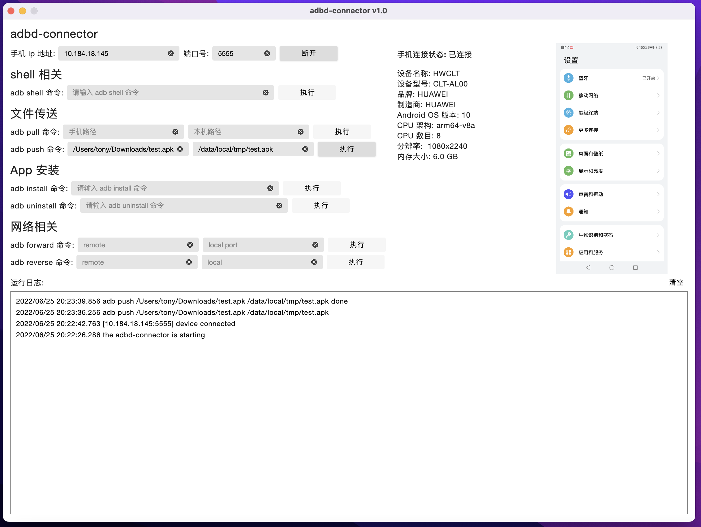
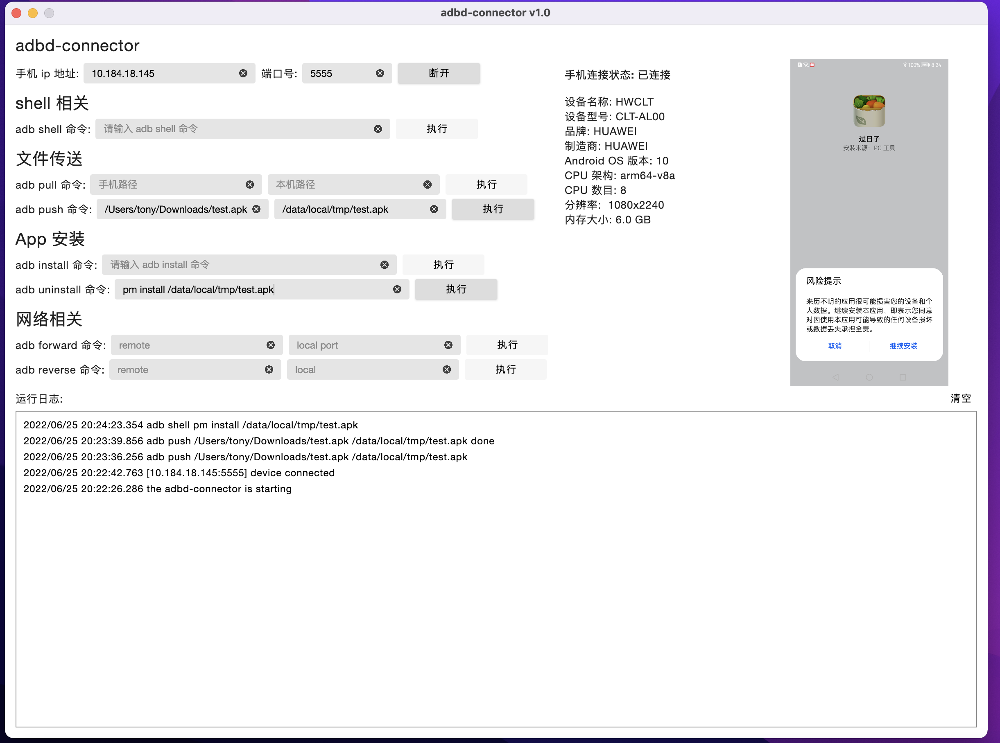
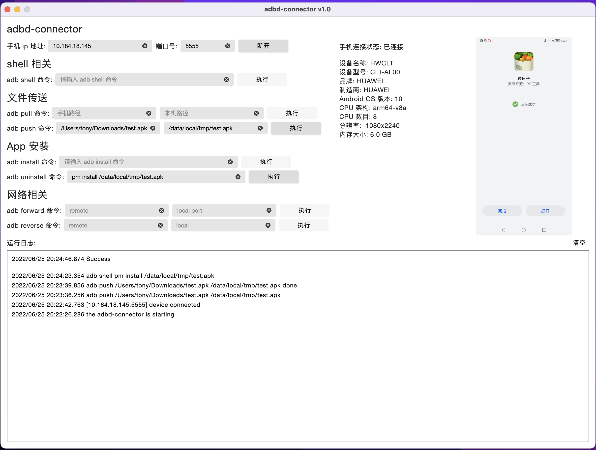

# adbd-connector

这是一个实现 adb server 和 adb daemon 之间的通信协议的库。

## 背景

下图中的 adb client 和 adb server 都共存在 PC 中，PC 上安装过 adb 程序就会有。adb dameon (简称adbd)是存在于 Android 手机中的一个进程/服务。

当我们启动命令行输入 adb 命令时，实际上使用的是 adb client，它会跟 PC 本地的 adb server 进行通信（当然，有一个前提先要使用 adb-start 启动 adb server 才能调用 adb 命令）。

然后 adb server 会跟 Android 手机进行通信（手机通过 usb 口连上电脑）。最终，我们会看到 adb client 返回命令执行的结果。

一次命令的执行包含了 1-6 个步骤。其实，还要算上 adb server 内部的通信和 adb dameon 内部的通信。一次命令的执行，路径会很长。

所以，一次完整的 adb 通信，会涉及如下的概念：

* adb client：运行在 PC 上，通过在命令行执行 adb，就启动了 ADB Client 程序
* adb server：运行于 PC 的后台进程，用于管理 ADB Client 和 Daemon 间的通信
* adb daemon(adbd)：运行在模拟器或 Android 设备上的后台服务。当 Android 系统启动时，由 init 程序启动 adbd。如果 adbd 挂了，则 adbd 会由 init 重新启动。
* DDMS：DDMS 将 IDE 和手机设备之间建立起了一座桥梁，可以很方面的查看到目标机器上的信息。
* JDWP：即 java debug wire protocol，Java 调试线协议，是一个为 Java 调试而设计的通讯交互协议，它定义了调试器和被调试程序之间传递的信息的格式。

在 adb server 和 adbd 之间有一个 TCP 的传输协议，它定义在 Android 源码的 system/core/adb/protocol.txt 文件中。只要是能通过 adb 命令连接的手机，都会遵循这个协议，无论是 Android 或是鸿蒙系统。

因此，基于这个协议实现了一个 TCP 的客户端(adbd-connector)就可以跟手机的 adbd 服务/进程进行通信，从而实现 adb 的所有指令。

另外，我还使用 Kotlin Compose Desktop 在这个协议上做了一层 UI，实现了一个在 PC 上的简易"手机助手"，且支持 Mac、Windows、Linux。

> 在手机连接前，先要打开手机的开发者模式。在连接过程中，手机会弹出信任框，提示是否允许 usb 调试。需要点击信任，才能完成后续的连接。
还要打开手机的 5555 端口(使用 adb 命令：adb tcpip 5555)，以及获取手机连接当前 wifi 的局域网 ip 地址。有了局域网的 ip 地址和端口，才可以通过 adbd-connector 跟 adbd 进行连接。

## 手机的连接效果：

连上手机可以获取手机的基础信息

## 执行 adb shell 命令的效果：

## install app 
需要分成2步：
1. 使用 push 命令将 apk 推送到手机的目录 /data/local/tmp/

2. 使用 adb shell pm install 命令进行安装

## uninstall app

adb shell pm uninstall 包名 

## reverse

将 TCP 端口从安卓设备中映射到 localhost

adb reverse tcp:{{远程端口}} tcp:{{本地端口}}